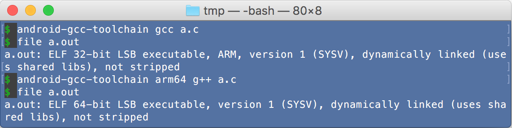
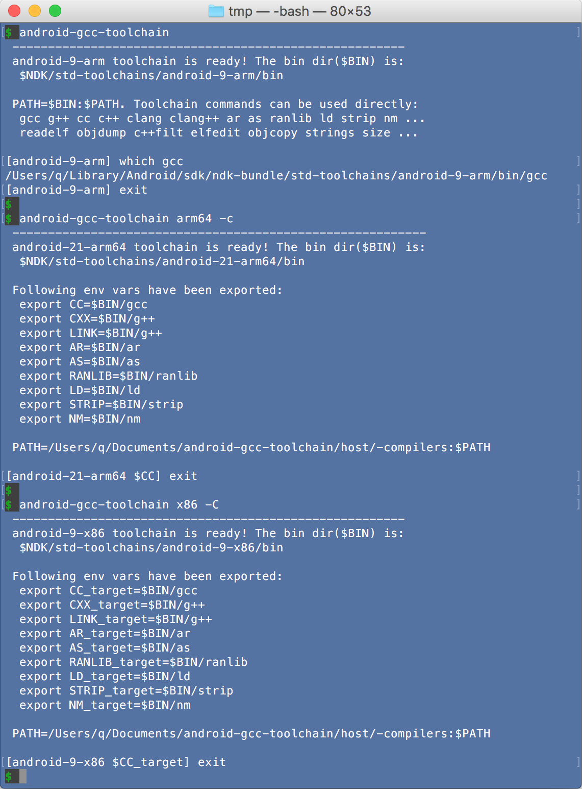

# android-gcc-toolchain
Enable you to use NDK's standalone toolchain easily, quickly and magically for cross-compile.

As an example, see [Build NodeJS for Android perfectly](https://github.com/sjitech/build-nodejs-for-android-perfectly).

Tested OS:
- **Mac**: OS X 10.11.5/10.11.6 EI Capitan (64bit)
- **Linux**: Ubuntu 16.04 (64bit)
- **Windows**: Windows Pro 7 (64bit). With [GIT Bash for Windows](https://git-for-windows.github.io/) installed.

Also tested in Docker (Docker image id: `osexp2000/android-gcc-toolchain`)
    via [Docker-Toolbox](https://www.docker.com/products/docker-toolbox).
    See [Features-9: Use this tool in Docker](#docker).

## Prerequisite

NDK: tested on
- [NDK 12.1.29](https://developer.android.com/ndk/downloads/index.html)

Install Android NDK and set env var `NDK` to the dir: `export NDK=__the_top_dir_of_installed_NDK__`.

Otherwise, it will guess NDK dir from env vars: ANDROID_NDK_ROOT ANDROID_NDK_HOME NDK_ROOT NDKROOT ANDROID_NDK ANDROID_SDK_HOME
 ANDROID_SDK_ROOT ANDROID_SDK ANDROID_HOME ANDROID_ROOT.

*With NDK, you do not need to install python, make, awk*

## Install

Nothing. Just use the `android-gcc-toolchain` with full path, 
otherwise link it to /usr/local/bin/ or add the path to the $PATH. 

<a name=ccache></a>
If you clean & compile repeatedly, **you'd better setup [CCACHE](https://ccache.samba.org/) to speed up repeating compilation**.
- Run `brew install ccache` on Mac or `sudo apt-get install ccache` on Linux
- `export USE_CCACHE=1` to tell android-gcc-toolchain to use CCACHE.
- optional: `export CCACHE_DIR=some_dir_in_fast_disk`(default is ~/.ccache).
- optional: run `ccache -M 50G` once to set max cache size(default is 5G).

## Screenshot

- Run android gcc related commands easily



<a name="dedicated-shell-screenshot"></a>
- Enter a dedicated shell where can run android gcc related commands easily



## Usage

Run commands in an android-oriented cross-compile environment.

*Note: words in `[  ]` means may be omitted. "|" means "or". {...} means selection. (default) means can be omitted*
<a name="options"></a>
```
Usage: android-gcc-toolchain [OPTIONS] [CMD [ARGS...]]
--------------------------------------------------------------------------------
OPTIONS: for toolchain, env mode, host compiler,...

Toolchain options: specify which toolchain to use or create
 [--arch] ARCH  Android architecture:
                {arm(default)|arm64|x86|x86_64|mips|mips64} or aliases:
                i386,ia32(=x86), x64(=x86_64), mipsel, mipsel64
 --api    APIL  Android API level:
                {min(default)|max|an integer}
 --stl    STL   C++ STL to use:
                {gnustl(default)|libc++|stlport}
 --force        Delete existing toolchain dir then create
 --copy         Force copy files instead of create hard link of files when
                create toolchain first time

Env mode options: Specify whether set $PATH or $CC... or $CC_target...
 omitted        This is the Redirect mode.
                Set $PATH to redirect gcc... to the toolchain's gcc...
                e.g. export PATH=$NDK/std-toolchains/.../bin:$PATH
 -c             Set $CC,$CXX,$LINK,$AR,$AS,$RANLIB,$LD,$STRIP,$NM
                e.g. export CC=$NDK/std-toolchains/.../bin/gcc
 -C             Set $CC_target,$CXX_target,$LINK_target,...,$NM_target
                e.g. export CC_target=$NDK/std-toolchains/.../bin/gcc

Host compiler option: Add/remove options to host compiler forcibly
 --host  RULES  Mandatory host compiler rules. Must be a comma joined 
                combination of available rules(Use --list-host-rules to show).
                This is done by supersede host compiler in $PATH by some
                wrapper scripts to add/remove option then transfer to original.

Other options:
 -v, --verbose  Show verbose information, include compiler arguments
 --version      Show version of this tool
--------------------------------------------------------------------------------
CMD and ARGS: The external command to be run

 CMD            Any command. Default is /bin/bash.
                To avoid ambiguous with other option, place - or -- before CMD
 ARGS...        The arguments for the CMD
--------------------------------------------------------------------------------
Environment variables affecting this tool

 USE_CCACHE=1   Compilers(gcc/g++/cc/c++/clang/clang++) will run via ccache
 AGCC_VERBOSE=1 Compilers(include ar as ranlib ld strip nm) will show arguments
```
----

## Features

### 1. Run android gcc related commands easily.

- Just prepend `android-gcc-toolchain` to your gcc related command.

    ```
    android-gcc-toolchain gcc a.c
    android-gcc-toolchain arm64 gcc a.c
    ```
    
<a name="dedicated-shell"></a>    
### 2. Start a dedicated shell where can run android gcc related commands easily ([Screenshot](#dedicated-shell-screenshot)).

- start an interactive shell with gcc... ready

    ```
    android-gcc-toolchain arm64                               #bash
    android-gcc-toolchain arm64 zsh                           #zsh
    ```

    See also: [About Redirect Mode](#about-redirect-mode) 

- start an interactive bash with $CC... predefined

    ```
    android-gcc-toolchain arm64 -c
    ```

    See also: [About env vars passed to CMD](#about-env-vars-passed-to-cmd) 

- start an interactive bash with $CC_target... predefined
    
    ```
    android-gcc-toolchain arm64 -C
    ```

    See also: [About env vars passed to CMD](#about-env-vars-passed-to-cmd).


- *Notes*

    To feed multiple commands to the shell non-interactively,
    you can use `<<EOF`[Here Document](http://tldp.org/LDP/abs/html/here-docs.html) or 
    `<<<"..."`[Here String(bash only)](http://tldp.org/LDP/abs/html/x17837.html)
    or `bash -c` to feed commands to the shell, or you call this tool multiple times.
    With options `arm64`,`-C` as example:
    
    ```
    $ android-gcc-toolchain arm64 -C <<EOF
    CMD1 ARGS... && CMD2 ARGS...
    EOF
    $ android-gcc-toolchain arm64 -C <<< "CMD1 ARGS... && CMD2 ARGS..." 
    $ android-gcc-toolchain arm64 -C sh -c "CMD1 ARGS... && CMD2 ARGS..." 
    $ android-gcc-toolchain arm64 -C CMD1 ARGS && \ 
      android-gcc-toolchain arm64 -c CMD2 ARGS... 
    ```

    *bash-only: you can use \EOF to disable pathname and var expansion*

### 3. Cross-compile an AUTOCONF project(e.g. ffmpeg) easily.

- Enter a gcc... redirected environment to build.

    ```
    OTHER_FFMPEG_OPTIONS="--disable-everything --disable-doc --enable-protocol=pipe --enable-filter=scale --enable-filter=crop --enable-filter=transpose --enable-demuxer=rawvideo --enable-decoder=rawvideo --enable-muxer=image2 --enable-muxer=image2pipe --enable-muxer=mjpeg --enable-encoder=mjpeg --enable-encoder=png"
    android-gcc-toolchain arm64 <<< "./configure --enable-cross-compile --target-os=linux --arch=arm64 $OTHER_FFMPEG_OPTIONS && make"
    ```

### 4. Cross-compile an GYP project(e.g. NodeJS) easily.

- Enter a gcc... redirected environment to build.

    ```
    android-gcc-toolchain arm64 <<< "./configure --dest-cpu=arm64 --dest-os=android --without-snapshot --without-inspector --without-intl && make"
    ```
    
    This is the most concrete way to do target-only cross-compile.
    Attempt to call gcc related commands without explicit path will fall into the toolchain's one.
    
- Enter a `$CC`... predefined environment to build.

    ```
    android-gcc-toolchain arm64 -c <<< "./configure --dest-cpu=arm64 --dest-os=android --without-snapshot --without-inspector --without-intl && make"
    ```
    
    *The first `-c` is for `android-gcc-toolchain`, not for bash.*   
    This is a graceful way to do target-only cross-compile.
    
- Enter a `$CC_target`... predefined environment to build.

    ```
    android-gcc-toolchain arm64 -C <<< "./configure --dest-cpu=arm64 --dest-os=android && make"
    ```
    
    *The `-C` is UPPER CASE.*  
    This is the most graceful way to do a hybrid cross-compile, it assumes:
    - Compiler commands for target(Android) honor the `$CC_target`...,
    - Compiler commands for host(Mac) honor the `$CC_host`... or `$CC`... or pick from `$PATH`.
    
    **But above command will run into error, just because several wrong project settings.**  
    You can use [Mandatory host compiler rules](#host-compiler-rules) to overcome them easily, 
    otherwise you have to find and modify the wrong settings each time.

### 5. Automatically get minimum/maximum `Android API level` from NDK.

- Specify `max`, `min`, or an valid Android API level to the tool.

    By default, get minimum API level from NDK for specified arch smartly, 
    from actual folder names `$NDK/platforms/android-*/arch-$ARCH`, instead of a fixed 21.

    ```
    $ android-gcc-toolchain arm64 --api max
      ...
      android-24-arm64 toolchain is ready! ...
    ```

### 6. Automatically create standalone toolchain at first time.

- As described in [options](#options), options are compatible with $NDK/build/tools/make_standalone_toolchain.py:
`--arch`,`--api`, `--stl`,`--force`,`--verbose`.

### 7. Use hard links to speed up creation of toolchain and save disk space.

- By default, use hard links. The creation became very fast.
- This is done by run a modified py file on-the-fly instead of original $NDK/build/tools/make_standalone_toolchain.py. 
- The modified py file replace shutil.copy2 and shutil.copytree with customized copy2 and copytree which use hard link.
- You can specify `--copy` to force use traditional copy mode. 

### 8. Support CCACHE to speed up repeating compilation.

- When you clean & compile repeatedly, you'd better use CCACHE.
- Need install CCACHE first and config it as described in [Install-CCACHE](#ccache).
- See [About how CCACHE are used](#about-how-ccache-are-used)

<a name=docker></a>
### 9. Use this tool in Docker (Docker image id: `osexp2000/android-gcc-toolchain`)

Assume in current dir($PWD) there are some files to be compiled by android compiler, then you can 
use following ways to compile it with the docker image. As a result, you will get result_exe in current dir. 

- Run docker to enter a interactive [dedicated shell](#dedicated-shell). e.g.
    
    ```
    $ docker run -it -v $PWD:/work osexp2000/android-gcc-toolchain arm64
    [android-21-arm64] cd /work && gcc a.cc -o result_exe
    ```

- Run docker and specify single command directly 

    ```
    docker run -v $PWD:/work osexp2000/android-gcc-toolchain arm64 g++ /work/a.cc -o /work/result_exe 
    ```

- Run docker and feed multiple commands to it with Here String 

    ```
    docker run -i -v $PWD:/work osexp2000/android-gcc-toolchain arm64 <<< "cd /work && g++ a.cc -o result_exe" 
    ```

- Run docker and feed multiple commands to it with Here Document

    ```
    docker run -i -v $PWD:/work osexp2000/android-gcc-toolchain arm64 <<EOF
    cd /work && g++ a.cc -o result_exe
    EOF
    ```

- Tips about docker file in/out:
    - Use volume mapping `-v HOST_DIR_OR_FILE:CONTAINER_DIR_OR_FILE` to map dir/files to container. 
      Note: **Docker-Toolbox on Windows need host dir or files is under `C:\Users\...`(e.g. C:\Users\q\Downloads),
      and the `HOST_DIR_OR_FILE` must be converted to `/c/Users/...` style. Besides, need env var MSYS_NO_PATHCONV=1**
    - Use `docker cp` to copy files in/out when forgot to use volume mapping.

<a name="show-compiler-command-line"></a>
### 10. Show compiler command line in verbose mode
 
- Triggered by env var `AGCC_VERBOSE=1` or specifying `-v` or `--verbose` option to `android-gcc-toolchain`,
    when any compiler(gcc g++ cc c++ clang clang++ ar as ranlib ld strip nm) process
    started from android-gcc-toolchain, its command line will be output.

    The output command line example:  
    ```
    $___ ccache '/Users/q/Library/Android/sdk/ndk-bundle/std-toolchains/android-9-arm/bin/arm-linux-androideabi-c++' \
    $___  '-D_GLIBCXX_USE_C99_MATH' \
    $___  '-I../deps/gtest' \
    $___  '-I../deps/gtest/include' \
    $___  '-Wall' \
    $___  '-Wextra' \
    $___  '-Wno-unused-parameter' \
    $___  '-Wno-missing-field-initializers' \
    $___  '-O3' \
    $___  '-fno-omit-frame-pointer' \
    $___  '-fPIE' \
    $___  '-fno-rtti' \
    $___  '-fno-exceptions' \
    $___  '-std=gnu++0x' \
    $___  '-MMD' \
    $___  '-MF' \
    $___  '/Users/q/Downloads/node/out/Release/.deps//Users/q/Downloads/node/out/Release/obj.target/gtest/deps/gtest/src/gtest-filepath.o.d.raw' \
    $___  '-c' \
    $___  '-o' \
    $___  '/Users/q/Downloads/node/out/Release/obj.target/gtest/deps/gtest/src/gtest-filepath.o' \
    $___  '../deps/gtest/src/gtest-filepath.cc'
    ```
    Each line is prefixed by $___ which is just for grep easily. Because $___ is empty string, you can copy paste lines to
    other place to run without modifying.

### 11. (TODO) Support brew install, bash_autocomplete 

----

## About where the toolchain created and what's in it

- This tool create dir in your NDK dir, in following format:   
 `$NDK/std-toolchains/android-APIL-ARCH[STL_TAG]`

- If NDK is upgraded, please specify `--force` to recreate toolchains 

- Basically, the toolchain is created by on-fly modified version of `$NDK/build/tools/make_standalone_toolchain.py`, 
    Use hard link by default instead of copy

- Some extra works:
    - Removed NDK's python,make,awk,yasm,gdb,ndk-depends... (prebuilt common utilities) from toolchain bin dir.
        As a fallback, append $NDK/prebuilt/*/bin/ to PATH so these utilities are available if no existing one.  
    - For default gnustl C++ STL only: enable use of `std::snprintf` 
        by `#inlcude <cstdio>` or `#include <string>` like libc++
        - Insert definition of `std::snprintf` to "$BIN"/../include/c++/?.?.?/cstdio
        - Append `#include <cstdio>` to "$BIN"/../include/c++/?.?.?/string
    - For mipsel gnustl only: ln -f "$BIN"/../include/c++/?.?.?/*/bits/*.h "$BIN"/../include/c++/?.?.?/bits/ 
        to avoid error of `bits/c++config.h not found` when specified `-mips32r2` to gcc/g++.
    - For CCACHE in Redirect Mode: created wrapper scripts in $BIN/../ccache/.
    - For CCACHE compiler hash: if use non default Android API level or non default C++ stl, then to let CCACHE know 
        compiler's include files changes, this tool set different timestamp to compiler commands gcc g++ cc c++ clang clang++. 

*?.?.? means gcc version such as 4.9.x*

### About NDK python,make,awk,yasm,gdb,ndk-depends... (prebuilt common utilities)

- The \$NDK/prebuilt/*/bin/ are always appended to \$PATH. so these utilities are
  always available, but not the first choice in \$PATH

## About Redirect mode

In this mode(means without -c|-C), the following commands are redirected to the toolchain's one.

- gcc g++ cc c++ clang clang++ ar as ranlib ld strip nm ...
- readelf objdump c++filt elfedit objcopy strings size ...

*cc is just a link to gcc*

*gdb is also available from $NDK/prebuilt/*/bin/ which already appended to $PATH*

## About env vars passed to CMD

- PATH: will be changed under certain conditions:
    use [Redirect mode](#about-redirect-mode) 
    or use [Mandatory host compiler rules](#host-compiler-rules))
    or use CCACHE([About how CCACHE are used](#about-how-ccache-are-used)). 
    When called recursively, it will be restored first
- GYP_DEFINES: will be set to "host_os=<mac|linux|$OSTYPE>" to specify host_os for gyp.
- Following vars will be set for $CC mode(-c) or $CC_target mode(-C), otherwise cleared:
 - CC CXX LINK AR CC_target CXX_target LINK_target AR_target
 - AS RANLIB LD STRIP NM AS_target RANLIB_target LD_target STRIP_target NM_target
- BIN: will be set as mnemonics, means the toolchain's bin dir 
- AGCC_BIN AGCC_HOST_COMPILERS_DIR: will be set for internal cleaner
- AGCC_VERBOSE=1 if -v(--verbose) is specified

## About how CCACHE is used

- Triggered by env var `USE_CCACHE=1`
- gcc g++ cc c++ clang clang++ will run via ccache
- Android compilers in $BIN dir are created as wrapper scripts which call ccache
- Host compilers are superseded in $PATH by wrapper scripts which call ccache 

<a name="host-option"></a>
<a name="host-compiler-rules"></a>
## About Mandatory host compiler rules (--host RULES): 

This tool provide wrapper scripts to supersede compiler commands(gcc|g++|cc|c++|clang|clang++) via $PATH, optionally.
These wrapper scripts 
- smartly find original compiler command in $PATH behind itself, 
- add or remove options then transfer to original compiler command.
- can be chained. The first specified, the first run.
 
The mandatory host compiler rules solves some common cross-compile problems on Mac or Linux:

- [Mac] **ar**: Some projects does not honor `$AR_target` when make android static
 lib(*.a). Instead, they call Mac ar command, so cause link error.
 
    `--host ar-dual-os` detect input \*.o file format, Mac or android, then call correct one.
 
- [Mac] **-lrt**: Some projects use link option `-lrt` (librt) comes from linux, but
 Mac have no librt, so cause link error "library not found for -lrt".
 
    `--host gcc-no-lrt` remove -lrt option.
 
- [Mac/Linux] **-m32**: On 64bit OS, some projects added `-m32` option to gcc to produce
 32bit codes, but some forgot, cause link error of mixing 64 and 32bit codes.
 
    `--host gcc-m32` prepend -m32 option if not specified.

- [Linux] **-lpthread**: Some projects forgot to add this option so cause strange link error:
 `...libpthread.so.0: error adding symbols: DSO missing from command line`.

    `--host gcc-lpthread` append -lpthread option, only when found any other -l option.

----
Good luck.
